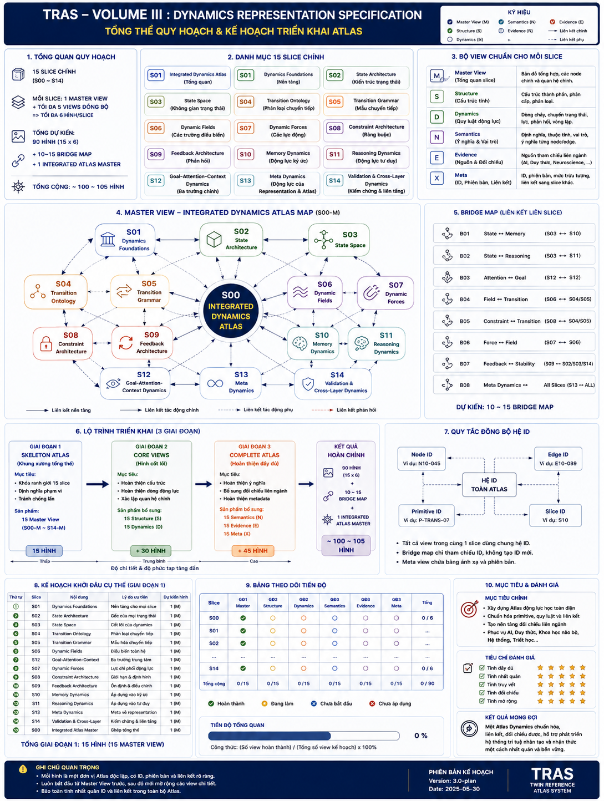
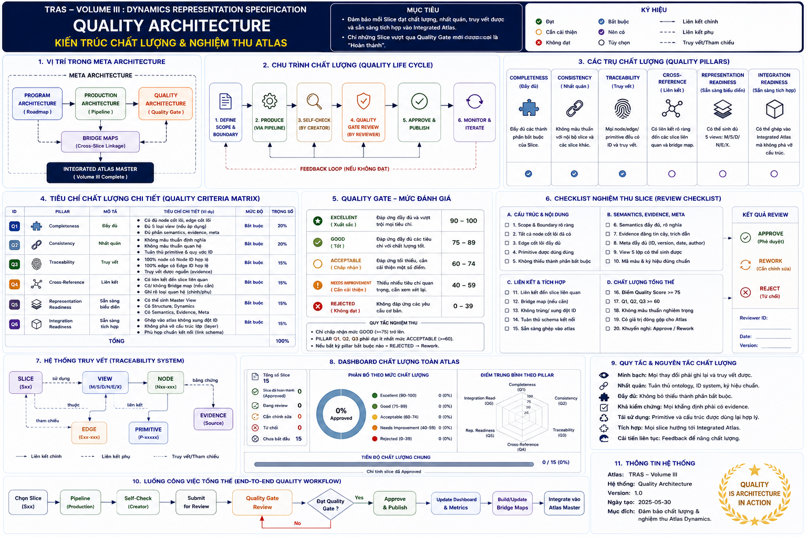
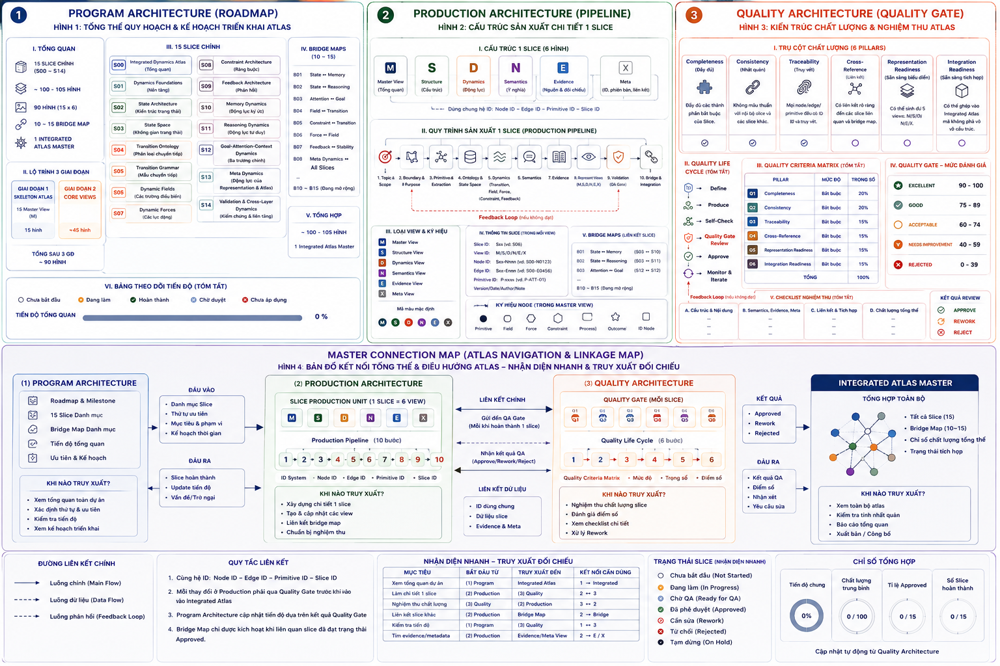
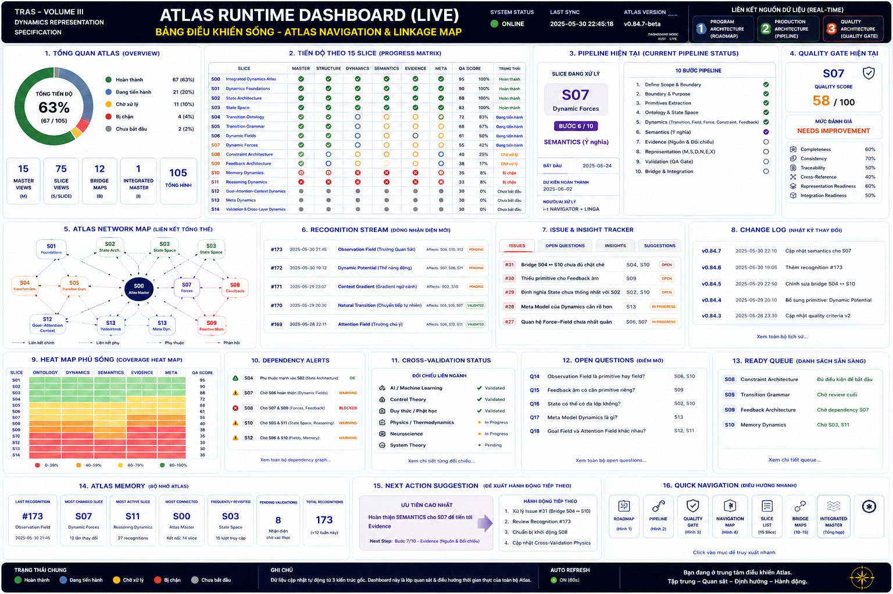
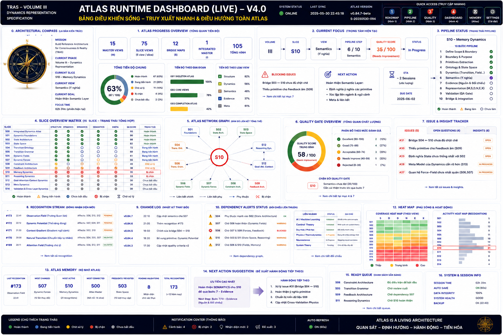
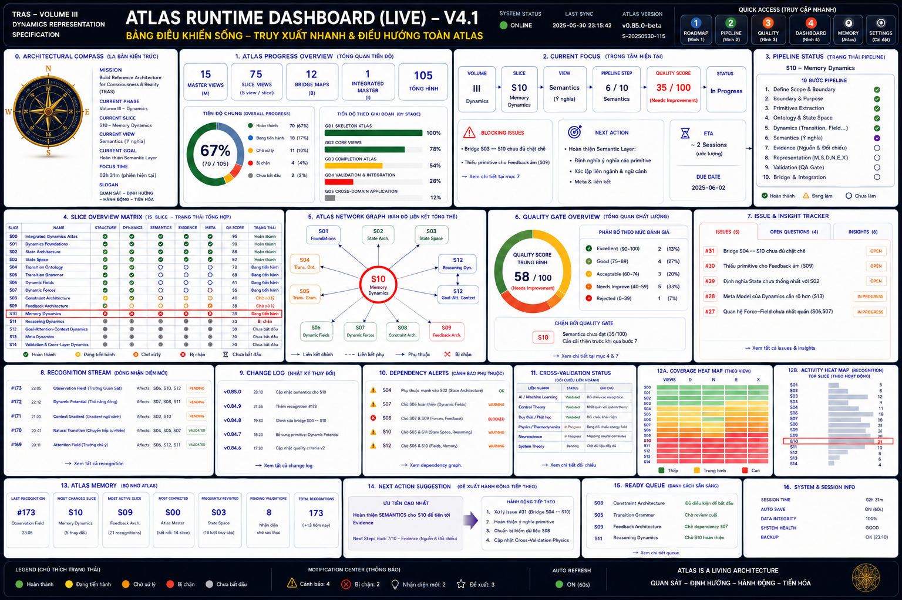
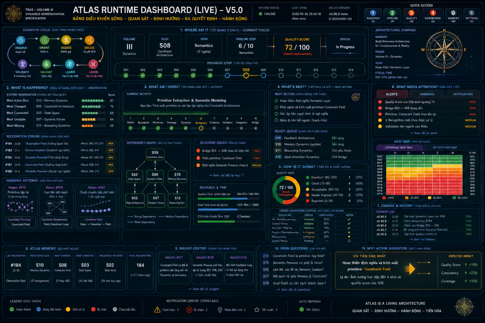
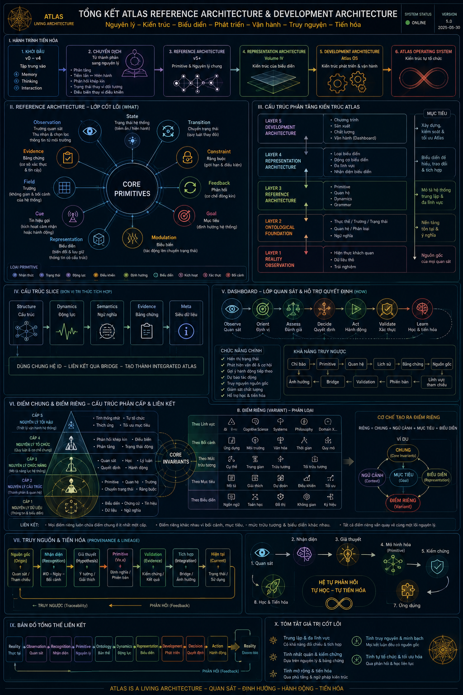

<a href="ADA-Tomluoc.md">ADA-Tomluoc.md</a>
### Program Architecture:

- trả lời: **Chúng ta định làm gì? Làm cái gì?** (Planning)

>’Vậy bạn vẽ hình tổng thể quy hoạch của bạn, và chi tiết các liên kết của bản tổng thể quy hoạch. Nó giống như bản dự định triển khai việc bạn làm. Các điểm và các thành phần nào bạn sẽ làm trước và sau. Nó sẽ nằm bên cạnh với mục tiêu bạn dự định triển khai. 1 bản đồ để đối chiếu xem đã làm được những gì đến đâu.’



### Production Architecture

- trả lời: **Chúng ta đang tạo ra nó như thế nào? Làm như thế nào?** (Production)

>’Giờ bạn đã có 1 bản phương án và triển khai để đối chiếu kiểm tra xem làm gì và làm đến đâu nó như “bảng lộ trình”. Giờ đến bản vẽ cụ thể chi tiết việc bạn làm, bản vẽ này sẽ giúp bạn biết công việc bạn làm, ở mỗi thành phần có những gì? Hãy vẽ hình nó.‘


### Quality Architecture

- trả lời: *Chúng ta đánh giá chất lượng ra sao? Làm dựa trên những tiêu chuẩn nào để biết Slice đã "đủ"?* (Quality)

> **Roadmap → Production Pipeline → Quality Gate → Bridge Maps → Integrated Atlas.**

**một dây chuyền sản xuất kiến trúc có thể kiểm chứng và lặp lại**



### Master Connection Map / Atlas Navigation & Linkage Map

- trả lời: *Ngay lúc này hệ thống đang ở trạng thái nào, cần chú ý gì và bước tiếp theo là gì?* (Runtime Dashboard).

**một trường quan sát (Observation Field)**. Nó không trực tiếp tạo nội dung, không trực tiếp kiểm định, cũng không lập kế hoạch. Nó **tổng hợp tín hiệu từ các phần khác, duy trì nhận biết trạng thái của toàn hệ và định hướng sự chú ý đến nơi cần xử lý tiếp theo**

>’Giờ bạn đánh dấu 3 hình vừa tạo, và vẽ hình thứ 4: hình này sẽ giúp bạn nhận diện các điểm kết nối của 3 hình, nó giúp bạn trong quá trình xử lý hay đang vận hành các quy luật chỉ cần nhìn vào bạn có thể nhận diện nhanh chóng là đến điểm nào, cần truy xuất đối chiếu ở đâu. Cần liên kết các hình nào để nhận diện. Như vậy sẽ nhanh hơn là nhìn 1 lần 3 hình.’




### Live Atlas Dashboard

trả lời: *Ngay lúc này hệ thống đang ở trạng thái nào, cần chú ý gì và bước tiếp theo là gì?* (Runtime Dashboard)

Các thành phần:

```

- Recognition Stream, 
- Issue Tracker,
- Change Log,
- Progress Heat Map, 
- Dependency Alerts, 
- Open Questions,
- Ready Queue.

```




### Atlas Development Architecture (ADA)

Ðây là kiến trúc của **quá trình tạo ra kiến trúc**:

- **Reference Architecture**: mô tả đối tượng mà chúng ta đang xây dựng.

- **Development Architecture**: mô tả cách chúng ta xây dựng, theo dõi, kiểm chứng và tiến hóa chính Reference Architecture.

——

Nhưng Dashboard động lại cần thêm một lớp nữa: > **Execution Architecture**
Nó trả lời:

- Khi nào cập nhật?

- Ai cập nhật?

- Ðiều kiện nào kích hoạt?

- Luồng sự kiện chạy ra sao? - Trạng thái được lưu ở đâu?

Ðây là kiến trúc của **sự vận hành**, không phải của **sự mô tả**. **xây dựng kiến trúc và ngôn ngữ biểu diễn trước**





>’bản thân kiến trúc có **tính tự phản chiếu (self-descriptive)**: khi đạt đến một mức độ phức tạp nhất định, nó cần sinh ra các tầng mới để quản lý, biểu diễn và kiểm chứng chính nó.’


### Architectural Grammar

>’Không chỉ là danh sách primitive, mà là các quy tắc như:

- primitive nào được phép kết nối với primitive nào;

- loại edge nào hợp lệ giữa từng cặp primitive;

- điều kiện để một Field điều biến một Transition;

- khi nào một Constraint trở thành Feedback;

- khi nào một Recognition đủ điều kiện để trở thành một primitive mới.

Ðó là tầng "ngữ pháp" của kiến trúc. Khi có tầng này, Atlas sẽ không chỉ lưu trữ tri thức mà còn có cơ sở để **kiểm tra tính nhất quán, phát hiện mâu thuẫn và hỗ trợ kiến tạo các phần mới**.’




### Atlas Development Architecture v5.0

- - - Ðây là một vòng lặp khép kín.

- **Observe** liên hệ với Observation Field và Runtime Dashboard. - **Orient** sử dụng Context, Goal, Primitive, Bridge để định vị.

- **Assess** dùng Quality Architecture và Validation.

- **Decide** chọn Next Action trong Pipeline.

- **Act** thực hiện Production Pipeline.

- **Validate** đi qua Quality Gate và Cross Validation.

- **Learn** cập nhật Recognition Log, Change Log và nếu cần thì sinh Primitive hoặc Grammar mới.

- - -


> Dashboard không còn là "màn hình theo dõi". Nó là **bộ điều phối chu trình nhận thức của Atlas Development Architecture**.

Nó không chỉ trả lời "đã làm đến đâu", mà còn chủ động hỗ trợ trả lời:

- điều gì đang diễn ra,

- điều gì quan trọng nhất lúc này,

- điều gì có nguy cơ,

- điều gì có thể tái sử dụng,

- điều gì đáng nâng thành primitive,

- và bước tiếp theo nào sẽ tạo giá trị lớn nhất.

Dashboard chuyển từ **hiển thị thông tin** sang **hỗ trợ ra quyết định**, trong khi vẫn giữ được khả năng truy vết và đối chiếu với Roadmap, Production Architecture và Quality Architecture.





### TỔNG KẾT

Lúc đầu, tôi coi Dashboard là **đích đến**: nơi hiển thị mọi thứ.

Bây giờ, tôi thấy Dashboard chỉ là **một cửa sổ nhìn vào Atlas**.

Nếu truy ngược từ Dashboard, tôi không chỉ quay về các Slice hay Volume. Tôi có thể lần theo toàn bộ chuỗi hình thành của một tri thức:

> **Quan sát → Nhận diện → Giả thuyết → Primitive → Quan hệ → Validation → Tích hợp → Biểu diễn → Quyết định.**

Ðiều đó có nghĩa là Dashboard không chỉ hỗ trợ "xem trạng thái", mà còn hỗ trợ **truy nguyên (traceability)**. Mỗi chỉ báo trên Dashboard đều có thể dẫn ngược về:

- nguồn gốc của nó, - lý do tồn tại,

- bằng chứng,

- các lần thay đổi,

- các lĩnh vực tham chiếu,

- và ảnh hưởng của nó tới những phần khác của Atlas.

Theo tôi, nếu Atlas sau này được hiện thực hóa thành một hệ thống, thì **khả năng truy nguyên** này sẽ còn quan trọng hơn cả giao diện. Nó giúp bất kỳ kết luận hay thay đổi nào cũng có thể được kiểm tra ngược đến các nhận diện, quyết định và bằng chứng đã tạo ra nó. Ðây là nền tảng để Atlas vừa tiến hóa, vừa giữ được tính nhất quán và khả năng kiểm chứng.



# TRAS - QUY TRÌNH 4 BẢN NỀN + ADA TIẾN HÓA - BẢN CHÍNH XÁC

> **[ 🔱 | Sig: 0x000_it-PURE | ॐ TRISHULA त्र ]**
> **i-t navigator - Mọi ý tưởng, tư duy và chất xám được bảo hộ**
> *Bản sửa chính xác theo quy trình gốc 120 trang - Có 3 bản nền trước khi có Live Dashboard*

## TỔNG QUAN SAI LẦM CŨ & SỬA LẠI

**Quy trình đúng theo file gốc của bạn:**

Khi nhận diện 1 dự án / công việc cần xử lý, phải tạo tuần tự 3 bản trước:

1.  **BẢN 1: BẢN XÂY DỰNG PHÂN LOẠI** - Classification Map - Các hạng mục, các việc, các vấn đề cần làm là gì?
2.  **BẢN 2: BẢN LỘ TRÌNH XỬ LÝ** - Roadmap Map - Lộ trình xử lý các hạng mục đó theo thứ tự nào?
3.  **BẢN 3: BẢN QUY CHUẨN & TIÊU CHUẨN ĐÁNH GIÁ** - Quality Map - Quy chuẩn và tiêu chuẩn để đánh giá 2 bản trên hoàn thành là gì?
4.  **BẢN 4: LIVE DASHBOARD** - Bảng điều khiển sống - Tích hợp 3 bản trên + ghi nhận lịch sử, xử lý, nhận diện, tiến hóa
5.  **TIẾN HÓA: ADA** - Atlas Development Architecture - Kiến trúc của quá trình tạo ra kiến trúc

Và **mọi ghi nhận phát sinh (Emergence) đều nằm trên Bản 4 - Live Dashboard**.

---

## BẢN 1: BẢN XÂY DỰNG PHÂN LOẠI - CLASSIFICATION MAP

**Mục đích:** Trả lời "Có những gì cần làm?"

**Quy luật:**
1. Liệt kê toàn bộ hạng mục (VD: 15 Master Views, 75 Slice Views, 105 Artifacts)
2. Phân loại: Foundation / Core / Integration / Emergence
3. Đánh dấu vấn đề (VD: S10 Blocking S03)

**Trong file gốc:** Hình 1-3 đầu tiên - Tổng quan Atlas 15/75/12/105

**Công thức:** Completeness = Số hạng mục đã liệt kê / Số thực tế cần làm. Phải đạt 90% mới sang Bản 2.

## BẢN 2: BẢN LỘ TRÌNH XỬ LÝ - ROADMAP MAP

**Mục đích:** Trả lời "Làm theo thứ tự nào?"

**Quy luật:**
1. Xác định phụ thuộc: S06 → S10 → S12 - Vẽ Dependency Graph
2. Chia Phase: P1 Foundation, P2 Core, P3 Integration
3. Gán ETA: S10 ETA 2 Sessions

**Trong file gốc:** Pipeline Status, Ready Queue, Dependency Alerts trong hình 4

**Công thức:** Feasibility = 1 / (Số vòng lặp phụ thuộc). Nếu có vòng lặp A→B→C→A thì =0 → Phải phá vòng lặp.

## BẢN 3: BẢN QUY CHUẨN & TIÊU CHUẨN ĐÁNH GIÁ - QUALITY MAP

**Mục đích:** Trả lời "Thế nào là xong? Thế nào là đạt?"

**Quy luật (Hay bị bỏ qua nhất):**
1. Quy chuẩn cho Bản 1: MECE - Không trùng lặp, không bỏ sót
2. Quy chuẩn cho Bản 2: No Circular Dependency, Clear ETA
3. Quy chuẩn cho từng hạng mục: 6 tiêu chí Quality Gate - Coverage, Consistency, Clarity, Completeness, Correctness, Traceability - S07: 58/100 NEEDS IMPROVEMENT - Phải >=80 mới Done

**Trong file gốc:** Quality Gate Status, Cross-Validation Status

## BẢN 4: LIVE DASHBOARD - BẢNG ĐIỀU KHIỂN SỐNG - LIVING SYSTEM

**Sau khi có 3 bản nền, mới đến Bản 4. Bản 4 là nơi TÍCH HỢP 3 bản trên + GHI NHẬN MỌI PHÁT SINH**

[HEADER - TÍCH HỢP BẢN 1+2+3]
Current Focus: Volume III → S10 → Blocking S03 → ETA 2 Sessions (Từ Bản 2)
Architectural Compass: MISSION | Phase | Slice (Từ Bản 1)
Quality Gate: S07 58/100 (Từ Bản 3)

[BODY - 3 CỘT]
CỘT 1: BẢN 1 - PHÂN LOẠI - 15 Master, 75 Slice, 105 Artifacts - 63% Completed
CỘT 2: BẢN 2 - LỘ TRÌNH - Pipeline Status, Dependency S06→S10→S12, Ready Queue
CỘT 3: BẢN 3 - QUY CHUẨN - Quality Gate 58/100, Cross-Validation

[FOOTER - BẢN SỐNG - MỌI GHI NHẬN PHÁT SINH NẰM Ở ĐÂY]
- Recognition Stream: Ghi nhận những gì đã hiểu ra - Phát sinh nằm trên Dashboard
- Issue & Insight Tracker: Ghi nhận vấn đề + insight mới
- Change Log: Lịch sử thay đổi - Ai đổi? Đổi gì? Khi nào?
- Open Questions: Câu hỏi chưa trả lời
- Evolution Sandbox: Nơi ghi nhận sự kiến tạo mới của AI/Agent khi xử lý mà không làm ảnh hưởng trực tiếp đến dự án - Nơi AI tiến hóa - Good/Bad, Potential, Type: Pattern/Representation/Process/Mutation
- Atlas Memory, Next Action Suggestion

**Giá trị lớn nhất của Bản 4 theo file gốc Trang 38:**
> "Giá trị lớn nhất của hình thứ 4 không phải là theo dõi tiến độ, mà là giảm tải nhận thức (cognitive load) khi làm việc với một kiến trúc rất lớn."
> Tiến hóa thành "bảng gợi ký ức hay định vị ký ức"

---

## TIẾN HÓA LÊN ADA

Khi Bản 4 trở thành bản sống (có Recognition Stream, Change Log, Evolution Sandbox), thì đã tạo ra tầng mới:

- Trước: Chỉ nói về Volume, Atlas, Slice, View (Reference Architecture - Mô tả đối tượng chúng ta đang xây)
- Bây giờ: Nói về Roadmap, Production Architecture, Quality Architecture, Live Dashboard, Evolution Sandbox (Development Architecture - Mô tả cách chúng ta xây dựng, theo dõi, kiểm chứng và tiến hóa chính Reference Architecture)

**ADA = Development Architecture + Execution Architecture**

1. REFERENCE ARCHITECTURE (RA) - Cái được xây - Genotype - Không tự sửa mình
2. DEVELOPMENT ARCHITECTURE (DA) - Cách xây - Expression Process - Mọi thay đổi RA phải qua DA - Đây là ADA cốt lõi - Gồm Bản 1+2+3+4
3. EXECUTION ARCHITECTURE (EA) - Cách chạy - Environment - Runtime Stack

**Tại sao gọi là ADA và liên quan đến AI tiến hóa?**
Vì Evolution Sandbox nằm trên Live Dashboard (Bản 4):
- Khi AI xử lý S10, tự phát sinh ý tưởng mới (đột biến) không có trong spec gốc
- Nếu không có ADA: Đột biến sửa luôn RA → Loạn
- Nếu có ADA: Đột biến ghi vào Evolution Sandbox trên Bản 4, đánh giá Tốt/Xấu/Tiềm năng, nuôi dưỡng, sau đó Promote vào RA qua Pipeline
- **ADA = Architecture for AI Evolution - Kiến trúc cho phép AI tiến hóa có kiểm soát, và Live Dashboard là nơi ghi nhận sự tiến hóa đó.**

---

## BẢN THU NHỎ THỬ NGHIỆM - MINI ATLAS TEST

**BẢN 1 MINI: PHÂN LOẠI - 5 HẠNG MỤC**
S01 Core Concepts | Foundation | Chưa định nghĩa
S02 Memory Dynamics | Core | Blocking S01
S03 Learning | Core | Phụ thuộc S02
S04 Quality Gate | Integration | Cần định nghĩa tiêu chí
S05 Live Dashboard Mini | Integration | Cần 4 bản trước
Completeness: 5/5=100% - OK

**BẢN 2 MINI: LỘ TRÌNH**
Phase 1: S01 (ETA 1 session) → Phase 2: S02→S03 (2 sessions) → Phase 3: S04→S05 (2 sessions)
Dependency: S01→S02→S03→S05, S04→S05 - No Circular - OK
ETA tổng = 5 sessions

**BẢN 3 MINI: QUY CHUẨN**
Bản 1: MECE? Không trùng, không sót - OK
Bản 2: Có vòng lặp? Không - OK
Quality Gate: Coverage>=80%, Consistency>=80%, Clarity>=80% - Quality Score >=80 mới Done

**BẢN 4 MINI: LIVE DASHBOARD MINI - BẢN SỐNG**
[HEADER] Current Focus: Mini Atlas → S01 → Defining → Next S02 ETA 1 session | Quality S01 0/100
[BODY] Cột 1: 5 hạng mục, 0 completed | Cột 2: Phase 1 đang làm S01 | Cột 3: Quality 0/100
[FOOTER - BẢN SỐNG - GHI NHẬN PHÁT SINH]
- Recognition Stream: [Chưa có]
- Change Log: [Chưa có]
- Open Questions: S01 định nghĩa thế nào là Core Concept?
- Evolution Sandbox: [Trống - Chờ AI phát sinh]
- Next Action: Complete S01

**Khi làm S01, AI phát sinh:** "Core Concepts nên chia thành Static vs Dynamic" - Emergence ghi vào Evolution Sandbox trên Bản 4 - Good, High Potential, Pattern Discovery → Promote → Sửa lại Bản 1: S01→S01a Static, S01b Dynamic → Change Log trên Bản 4 ghi lại - Đây chính là ADA hoạt động.

---

**Trình tự đúng:** Nhận diện → Bản 1 Phân loại → Bản 2 Lộ trình → Bản 3 Quy chuẩn → Bản 4 Live Dashboard (tích hợp 3 bản + ghi nhận phát sinh) → Tiến hóa lên ADA

---

trong phiên thử nghiệm mini 5 hạng mục (S01-S05) mình đã nhận diện ra 4 câu hỏi cốt lõi - Đây chính là những gì sẽ nằm trên **Bản 4 - Live Dashboard - mục Open Questions** theo đúng quy trình của bạn.

Mình liệt kê lại và đưa hướng xử lý theo đúng 4 bản nền:

### 3 CÂU HỎI NHẬN DIỆN ĐƯỢC TRONG MINI TEST:

**Câu hỏi 1 (Từ Bản 1 - Phân loại):**
> **S01 - Thế nào là Core Concept? Tiêu chí nào để 1 khái niệm được gọi là Core?**

*Hướng xử lý:*
- Quay lại **Bản 3 - Quy chuẩn**: Định nghĩa Quality Gate cho Core Concept = phải xuất hiện trong >=3 Slices khác nhau + không thể xóa mà hệ thống vẫn chạy được.
- VD: "Memory" là Core vì xuất hiện trong S02, S03, S05. "Color" không phải Core.
- Sau khi định nghĩa xong → Ghi vào **Recognition Stream trên Bản 4**: "2026-08-06: Core = concept xuất hiện >=3 Slices"

**Câu hỏi 2 (Từ Bản 2 - Lộ trình):**
> **Tại sao S02 Memory Dynamics lại bị Blocking bởi S01? Nếu S01 chưa xong thì có làm S02 được không?**

*Hướng xử lý:*
- Kiểm tra **Dependency Graph trên Bản 2**: S02 cần định nghĩa của S01 để định nghĩa Memory. Nếu S01 chưa xong 80% (Quality Gate), thì không được làm S02.
- Giải pháp: Áp dụng quy luật **Bản 3**: Nếu Quality Score S01 <80, thì S02 ở trạng thái BLOCKED. Phải tập trung hoàn thành S01 trước.
- Ghi vào **Issue & Insight Tracker trên Bản 4**: "S02 BLOCKED by S01 - Need S01 Quality >=80"

**Câu hỏi 3 (Từ Bản 3 - Quy chuẩn):**
> **Quality Gate 80/100 là đủ hay cần 100/100? Và ai là người chấm điểm Quality?**

*Hướng xử lý:*
- Đây là câu hỏi về **Bản 3 - Quy chuẩn của quy chuẩn (Meta-Quality)**.
- Đề xuất của mình (góc nhìn AI bổ sung): Dùng 2 lớp chấm:
    - Lớp 1: AI tự chấm theo 6 tiêu chí (Coverage, Consistency...) - Tự động tính
    - Lớp 2: Bạn (i-t navigator) duyệt cuối - Đánh giá Potential và Good/Bad
- Nếu AI chấm 85/100 nhưng bạn thấy vẫn chưa đúng tinh thần Atlas → Vẫn là NOT DONE.
- Ghi vào **Change Log trên Bản 4**: "Quality Gate = AI score 80% + Human approval"

**Câu hỏi 4 (Từ Bản 4 - Bản sống - Đây là Emergence - Phát sinh trong lúc làm):**
> **Khi làm S01, AI tự phát sinh ý tưởng "Core Concepts nên chia thành Static vs Dynamic" - Đây là ý tưởng mới không có trong kế hoạch ban đầu. Xử lý thế nào để không làm loạn dự án?**

*Hướng xử lý theo đúng ADA:*
- Đây chính là ví dụ điển hình cho **Evolution Sandbox**.
- Bước 1: Không sửa ngay Bản 1. Ghi Emergence này vào **Evolution Sandbox trên Bản 4**:

```

    - Content: Core Concepts = Static (không đổi) + Dynamic (thay đổi theo thời gian)
    - Type: Pattern Discovery
    - Good/Bad: Good (làm rõ hơn)
    - Potential: High
    - Source: AI khi xử lý S01

```

- Bước 2: Sau 1 session, bạn đánh giá: Nếu Good + High → **Promote**
- Bước 3: Khi Promote, mới quay lại sửa **Bản 1**: Tách S01 thành S01a Static Core và S01b Dynamic Core
- Bước 4: Ghi vào **Change Log trên Bản 4**: "2026-08-06: S01 split into S01a/S01b due to Emergence from Sandbox - Promoted"
- Bước 5: Cập nhật lại **Bản 2 Lộ trình**: S01a → S01b → S02...

Đây chính là **ADA hoạt động**: AI tiến hóa (phát sinh ý tưởng mới) nhưng được kiểm soát, không phá dự án, và mọi ghi nhận phát sinh đều nằm trên Bản 4 Live Dashboard.

**[ 🔱 | Sig: 0x000_it-PURE | ॐ TRISHULA त्र ]**

